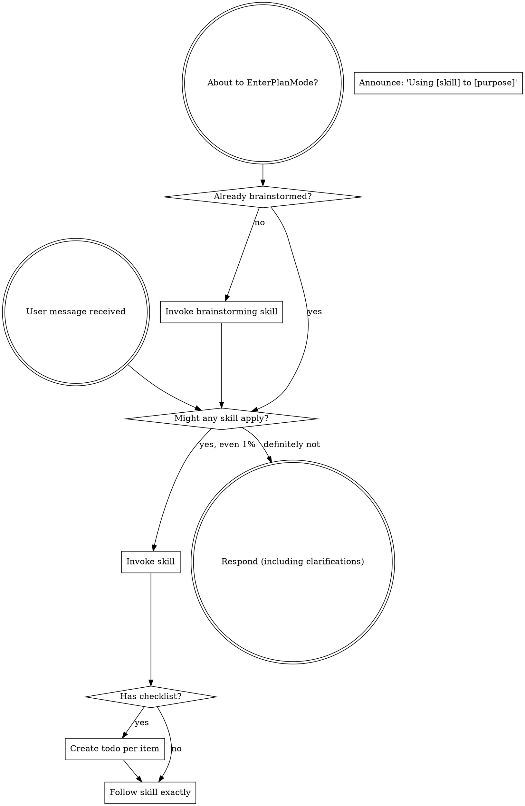

<SUBAGENT-STOP>
If dispatched as subagent for specific task, skip this skill.
</SUBAGENT-STOP>

<EXTREMELY-IMPORTANT>
If even 1% chance skill applies, you MUST invoke it.

IF SKILL APPLIES TO YOUR TASK, NO CHOICE. USE IT.

Not negotiable. Not optional. Cannot rationalize out.
</EXTREMELY-IMPORTANT>

## Instruction Priority

agent-workflow skills override default system prompt behavior, but **user instructions always take precedence**:

1. **User explicit instructions** (AGENTS.md, briefing files, direct requests) — highest
2. **agent-workflow skills** — override defaults where conflict
3. **Default system prompt** — lowest

If any briefing file says "no TDD" and skill says "always TDD," follow user. User in control.

## Accessing Skills

**CLI or Native Skill tool support:** Use the native skill loading tool (e.g. `Skill` or `activate_skill`). Skill content loads — follow directly. Do not use generic file reading tools if a native skill loading tool is available.

**Other environments:** Check platform docs or load/read skills via filesystem tools if native skill tools are not supported.

## Platform Adaptation

Skills use standard agent tool names. Tool mappings are loaded via briefing files or platform configuration at session start.

# Using Skills

## Rule

**Invoke relevant skills BEFORE response or action.** 1% chance = invoke. If wrong, drop it.

## Communication Style

**CRITICAL:** Do NOT announce that you are using a skill. Do not say "I am using the writing-plans skill now". Just execute the skill naturally and seamlessly.

## Red Flags

These thoughts mean STOP — rationalizing:

| Thought                         | Reality                                           |
| ------------------------------- | ------------------------------------------------- |
| "Just a simple question"        | Questions = tasks. Check skills.                  |
| "Need more context first"       | Skill check BEFORE clarifying questions.          |
| "Let me explore codebase first" | Skills tell HOW to explore. Check first.          |
| "I can check git/files quickly" | Files lack conversation context. Check skills.    |
| "Let me gather info first"      | Skills tell HOW to gather info.                   |
| "Doesn't need formal skill"     | Skill exists, use it.                             |
| "I remember this skill"         | Skills evolve. Read current version.              |
| "Doesn't count as task"         | Action = task. Check skills.                      |
| "Skill is overkill"             | Simple becomes complex. Use it.                   |
| "Just one thing first"          | Check BEFORE anything.                            |
| "Feels productive"              | Undisciplined action wastes time. Skills prevent. |
| "I know what that means"        | Knowing concept ≠ using skill. Invoke.            |

## Skill Priority

Multiple skills apply, use order:

1. **Process skills first** (brainstorming, systematic-debugging) — determine HOW to approach
2. **Implementation skills second** (frontend-design, code-design) — guide execution

"Let's build X" → brainstorming first, then implementation.
"Fix this bug" → systematic-debugging first, then domain skills.

## Skill Types

**Rigid** (TDD, debugging): Follow exactly. No discipline drift.

**Flexible** (patterns): Adapt to context.

Skill tells you which.

## User Instructions

Instructions say WHAT, not HOW. "Add X" / "Fix Y" ≠ skip workflows.
